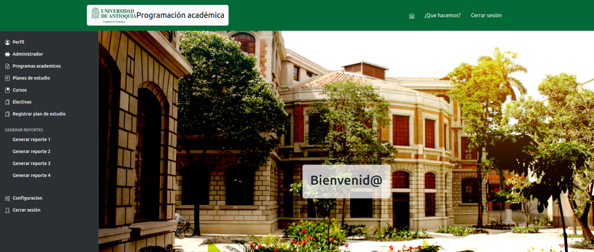

Example of project - Indigo Minimalist Jekyll Template - [Demo](https://sergiokopplin.github.io/indigo/). This is a simple and minimalist template for Jekyll for those who likes to eat noodles.

---

What has inside?

- Gulp
- BrowserSync
- Stylus
- SVG
- No JS
- [98/100](https://developers.google.com/speed/pagespeed/insights/?url=http%3A%2F%2Fsergiokopplin.github.io%2Findigo%2F)

---

[Check it out](https://sergiokopplin.github.io/indigo/) here.
If you need some help, just [tell me](https://github.com/sergiokopplin/indigo/issues).