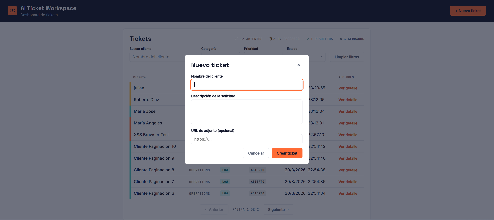
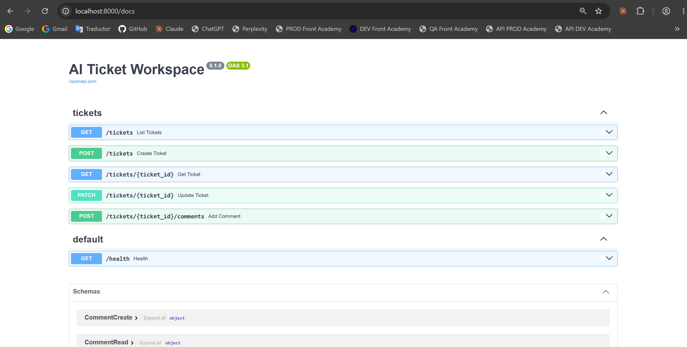

## Contexto

AI Ticket Workspace es una aplicación web para la recepción, clasificación automática y seguimiento de tickets operacionales (finanzas, legal, compras y operaciones). La construí como un ejercicio personal para poner a prueba mis habilidades con las herramientas de IA que están cambiando la forma de construir software hoy en día, con el foco puesto en usar IA de forma seria dentro del producto y no solo como demo: los tickets se crean desde un dashboard, se clasifican automáticamente (categoría, prioridad y resumen) y se gestionan mediante un flujo de estados con comentarios de seguimiento.

## Stack Técnico

- **Backend:** FastAPI + SQLModel sobre PostgreSQL
- **IA:** Anthropic SDK (Claude)
- **Frontend:** HTML/CSS/JS vanilla, sin frameworks
- **Infraestructura:** Docker y Docker Compose

## Características principales

**Clasificación automática con IA vía tool-use forzado**
Cada ticket se clasifica con Claude usando function calling con `tool_choice` forzado y un JSON Schema estricto, en vez de parsear texto libre. Esto garantiza que `category` y `priority` siempre caigan dentro de los valores permitidos, incluso si alguien intenta manipular el texto del ticket con prompt injection. Si la clasificación falla por cualquier motivo, el ticket igual se crea sin bloquear al usuario.

**Enriquecimiento de contexto a partir de adjuntos**
Si el ticket incluye una URL de adjunto, su contenido se descarga y se incorpora a la clasificación. Para HTML, texto plano, Word y Excel se extrae el texto y se añade como contexto adicional. Para PDF e imágenes usé los content blocks nativos de la API de Claude en vez de OCR propio, lo que permite que el modelo interprete visualmente el documento, incluyendo PDFs escaneados sin capa de texto extraíble.

**Dashboard operacional**
Listado de tickets con búsqueda por cliente, filtros por categoría/prioridad/estado, ordenamiento por columnas, paginación y un resumen del conteo de tickets por estado.

**Gestión del ciclo de vida del ticket**
Vista de detalle con la clasificación de IA, cambio de estado, asignación de responsable y un hilo de comentarios de seguimiento.

---

**Dashboard** — listado de tickets con filtros, ordenamiento por columnas y paginación:

**Creación de ticket** — modal accesible desde "+ Nuevo ticket":

**Detalle del ticket** — clasificación IA, gestión de estado/responsable y comentarios:

**Documentación de la API** — generada automáticamente por FastAPI (Swagger/OpenAPI):

---

## Repositorio

🔗 **GitHub:** [https://github.com/andresprogramacion123/sysdatec-ai-ticket-workspace](https://github.com/andresprogramacion123/sysdatec-ai-ticket-workspace)
